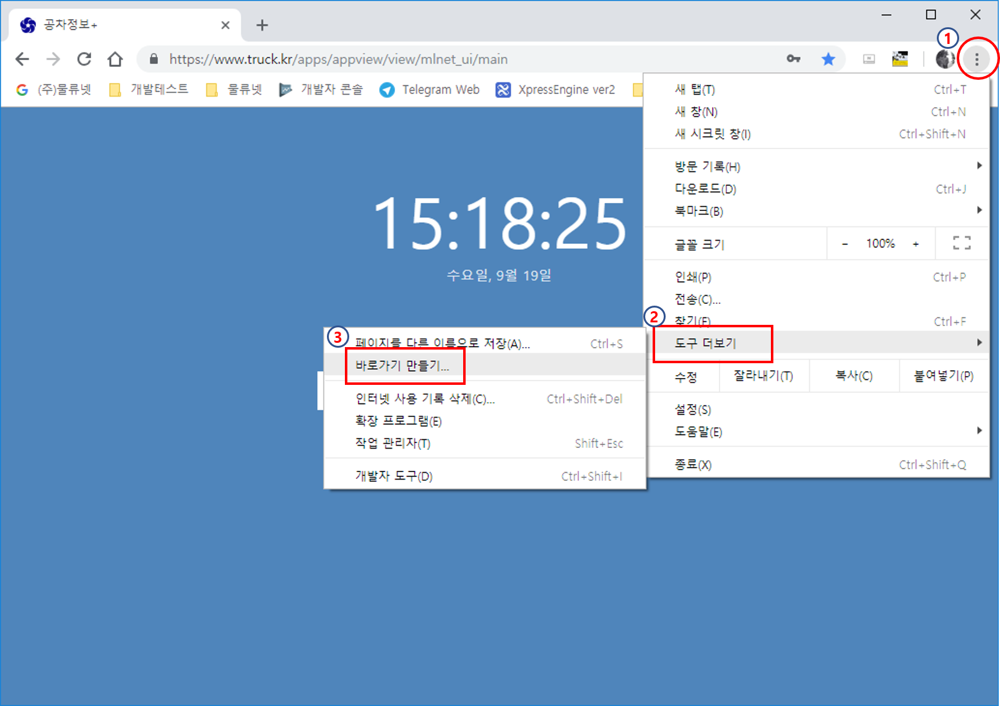

이 페이지는 공차정보+를 설치하고 사용하는데 도움이 되고자 만든 문서입니다. 이미 설치되어 있다면 [**공차정보+ 사용방법**](truckplus.md)로 건너 뛸 수 있습니다.

## 공차정보+ 설치

공차정보+는 크롬이 먼저 설치가 되어있어야 만 사용할 수 있읍니다. 물론 **FireFox**나 **엣지**를 사용하여도 무방합니다. 그런데 크롬을 사용하는 이유는 바탕화면에 아이콘을 생성하여 앱을 구동하듯이 사용하는 기능이 있어 크롬을 사용합니다.

크롬을 설치하시려면 [**`크롬 다운로드`**](https://www.google.com/chrome/) 사이트를 연결하여 설치하시기 바랍니다. 

### 바탕화면에 공차정보+ 아이콘 생성하기

1. 크롬을 실행한다.
2. 아래 웹 사이트 주소를 복사하여 크롬 주소창에 붙여넣기를 한다.
    > https://www.truck.kr/apps/appview/view/mlnet_ui/main

3. 페이지가 다음과 같이 열린다.

4. 다음으로 아래 그림의 순서대로 메뉴를 열어 **바로가기 만들기...**를 선택한다. 

5. 다음과 같이 **`바로가기를 만드시겠습니까?`**라는 창이 아래 그림처럼 나타단다.

6. **`만들기`**를 클릭하면 바탕화면에 공차정보+ 아이콘이 생성된다.

## 고객지원

공차정보+를 사용하다 보면 사용방법을 잘 몰라 불편한 사항을 격는 경우가 많다. 그럴때는 사용자가 물류넷에 문의하기 위해 전화를 많이 걸어온다. 고객의 문의 사항을 듣다보면 원격 연결을 하여 설명을 해야할 때가 대부분이다. 그래서 물류넷은 고객사에 편하게 지원할 수 있는 원격지원 시스탬이 구비되어 있다.

그래서 물류넷 원격지원 시스탬을 편리하게 사용하는 방법을 다름과 같이 지원한다.